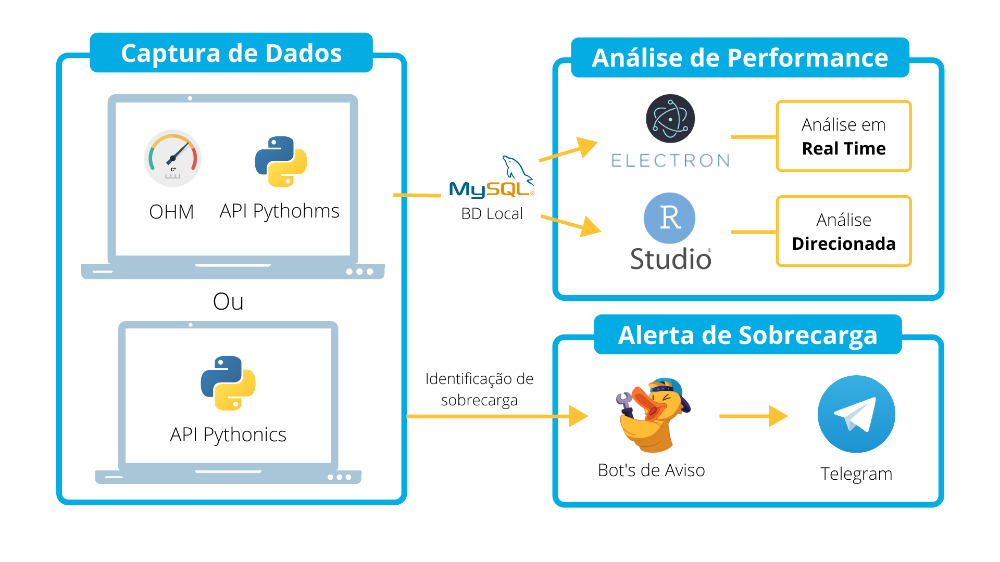

# Olá e boas vindas ao projeto PNEU

#### Projetando números, efetuando upgrades

# Introdução:

A PNEU nasceu de uma necessidade que surgiu no semestre inicial de 2020, a de desenvolver um projeto que visava o monitoramento de algo externo, utilizando sensores e arduino.

Muitos temas vieram à tona e foram considerados, porém, a ideia que nos cativou foi a de monitorar o fluxo de automóveis em rodovias, para que as concessionárias que as admnistram possam saber de forma mais assertiva a maneira onde e quando investir seus recursos monetários no que tange manutenção(preventiva e preditiva) da via, vem como nortear a precificação de publicidade em trechos mais movimentados.

Para demonstrar o funcionamento de nossa solução, aqui está um LLD:

como podemos observar, nosso projeto decorre em 3 etapas, a primeira que monitora a rodovia atráves de sensores posicionados ao longo da via e também em pontos estratégicos, a segunda que armazena e trata os dados obtidos, por fim, a última, que exibe as informações ao usuário final, um funcionário da concessionária.

Essa é a home do nosso site, onde o colaborador citado acima vai entrar em seu dia a dia:

Ao logar e passar por nossa verificação em duas etapas, o usuário da rodovia estará servido com uma série de gráficos, a começar por um que é atualizado em tempo real, de algum(ou alguns) trecho(s) que ele escolha monitorar (além de ter um sistema de avisos para fluxo baixo,normal ou alto) e outros que são valiosos para uma análise mais aprofundada, uma vez que disponibilizam dados de períodos de tempo que ja passaram(meses, anos ou semanas).

Essa é a nossa visão de negócios e proposta para os clientes, no entanto, no segundo semestre nos foi concebido um novo desafio

# Um novo começo

Esse desafio, além de técnico, foi também organizacional, uma vez que 4 membros da nossa equipe mudaram, sobrando apenas 2 membros fundadores.
 
O desafio técnico levava em conta tudo que foi previamente desenvolvido no primeiro semestre e propunha um pensamento de expansão. E se a PNEU crescesse muito e tivesse diversos servidores para lidar com a demanda de tráfego de dados, como nós garantiriamos um serviço que não irá deixar o cliente na mão?

Como nós saberíamos que tem algo de errado acontecendo com nossas máquinas que possa vir a ocasionar um erro e principalmente, como lidar com esse erro e documentá-lo para que no futuro  saibamos como agir?

Portanto, a PNEU olhou para dentro, para nosso cliente interno e para lidar com essa demanda, desenvolvemos um conjunto de ferramentas para monitorar nossos servidores.

A primeira ferramenta, é uma aplicação Java, que tem foco em cadastro dos servidores a serem monitorados, seus componentes e os usuários que irão usar nosso sistema de monitoramento, seja como analista ou gerente , tudo isso rodando em nuvem e os dados sendo armazenados no MySQL rodando em docker, além disso, nossos sistema é conectado ao Jira, para que sempre que seja efetuado um cadastro, update ou deleção, seja aberto um chamado para que seja possível rastrear erros.

Aqui está a arquitetura dessa aplicação, que pode ajudar em seu entendimento:

Uma vez qye temos os servidores e seus componentes cadastraos, podemos começar a monitorá-los.

Para obter os dados das máquinas, nós utilizamos 2 API's em python, a primeira que utiliza o pacote psutil para obter dados sobre o uso de CPU, memória e disco, no entanto, por motivos de segurança, o Windows barra o acesso de app's não nativos à bios, onde obtemos informações sober a temperatura e clock da CPU.

Para transpor esse desafio, utilizamos o Open Hardware Monitor (OHM), um software que utiliza Dll's do Windows para obter esses dados.

É possível rodá-lo em localhost e com isso, nós desenvolvemos um Web Crawler (a segunda API python) que captura e filtra somente as informações que desejamos (temperatura e clock da CPU).

Com isso estabelecido, é válido e necessário dizer que ambas API's inserem os dados obtidos no MySQL local.

Também em ambas API's, rodamos em paralelo dois Bot's conectados ao Telegran, um que é responsável por exporadicamente fornecer um log sobre a leitura de componentes e também alertas em casos que a leitura ultrapasse os limites estabelecidos, o outro, serve como uma base de conhecimento em que é possível verificar erros que já aconteceram e medidas para resolvê-lo.

Para exibir os dados e criar fluxos de trabalho para analistas de perfomance e gerentes de incidentes, nós desenvolvemos um aplicativo utilziando um framework muito popular, o Electron.

Ele emula um navegador, nos habilitando a utilizar HTML,CSS, JavaScript,Node.js e outras ferramentas e além disso, também é exportável parar gerar um app.

Em nossa plataforma, há dois caminhos principais que podem ser seguidos.

Analista:

No caminho do analista, é possível filtrar qual servidor você desejar analisar e então o fazer, em conjunto com os Bot's do Telegram.

Gerente:

Seguindo com a parte do gerente, essa pessoa terá uma visãi mais generalizada de todos os servidoresm bem como filtrá-los e também ver "mais de perto" caso necessário, é interessante também observar que há indicadores visuais com cores sobre o estado de cada componente de cada servidor.

Como gerente, também é possível ver o quanto estamos gastando com a aplicação na nuvem e previsões de gasto para o futuro, tudo isso na tela Billing.

Aqui está um LLD, para ilustrar o processo de monitoramento:
 

Esse é o projeto PNEU, obrigado pelo seu tempo.
